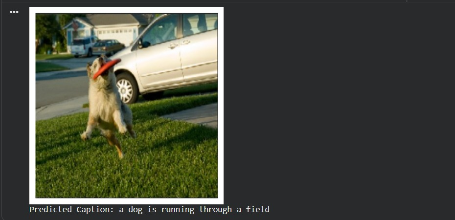
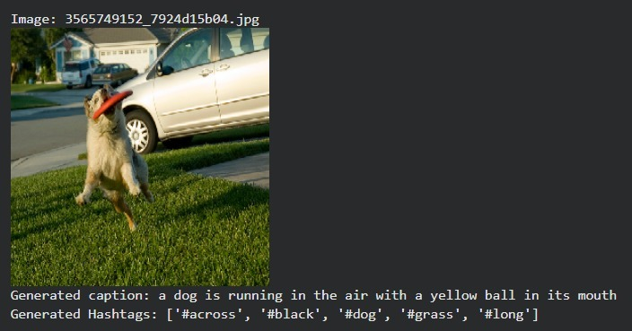
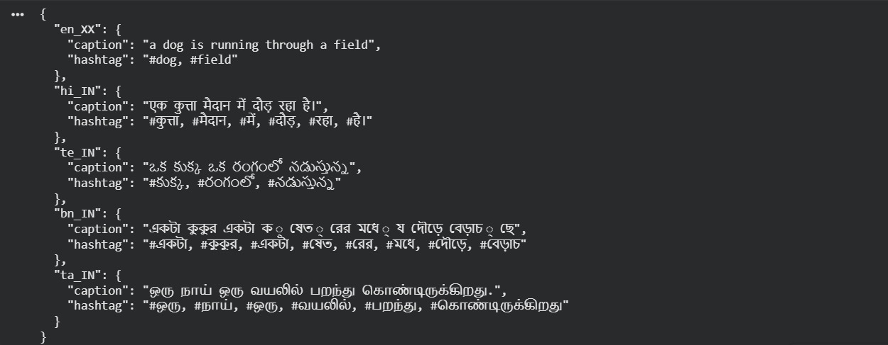

# Image Captioning and Hashtag Generation

## Overview

This project aims to extend the research work done in the paper "Show and Tell: A Neural Image Caption Generator" Vinyals et al. CVPR 2015 to generate image captions along with relevant social media hashtags. 

This work is submitted as a project for coursework CS787: Generative Artificial Intelligence, IIT Kanpur

Hashtags are keywords or phrases preceded by the “#” symbol (for example, #travel, #foodie, #sunset). They help categorize and group content on social media platforms. Image captions are text descriptions that explain what is happening in an image. 

Along with generating captions and hashtags, this project also aims at translating generated captions to Indian regional languages.

  

## Code and Models
The trained models for image captioning and hashtag generation can be accessed using the below Google Drive link.
 
[Trained models](https://drive.google.com/drive/folders/1FeyQQgkxMJnPI_5B3MWyv1poojFLb98y?usp=sharing)

Implementation of the project objectives are present in the following files:

**1_KD(show&tell)_transformer_training.ipynb**  
**2_CNN_transformer_inference.ipynb**  
**3_ImageHashtagsGenerator.ipynb**  
**4_unet_pconv.ipynb**  

**1_KD(show&tell)_transformer_training.ipynb** for training and **2_CNN_transformer_inference.ipynb** for inference. The training pipeline applies knowledge distillation on the original Show-and-Tell model and then trains a second pipeline combining CNN + Transformer with an additional step that converts generated captions into regional-language hashtags. The inference notebook loads the trained models and evaluates them on new images.
Before running either notebook, download the required models from the Google Drive link provided and update their paths at the top of each file. The models required are: student_distilled.keras, transformer_saved_model_full.keras, best_show_tell_student.weights.h5, and the vocabulary file tokenizer_vocab.json.

**3_ImageHashtagsGenerator.ipynb** contains a GRU based implementation of a generative model for hashtag generation. The model is trained on Flickr8k dataset. To run the notebook update the path present in the topmost cell of the file.

In **4_unet_pconv.ipynb**,
1st cell: unet training code for mask prediction of damaged image.
2nd cell: partial conv unet training code for inpainting of damaged image.
3rd cell: complete inference code for both the models combined. We have to update the paths of trained unet and partial conv unet model and target directory from where you have to take input images. The outputs are stored in the provided output directory.

## Results

Results infered on a test file **test_0** are given in **/results** dir.

A few more infered images:

